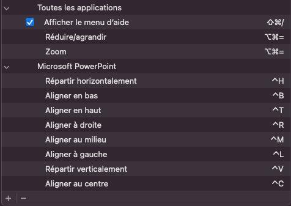

# Scripts to setup computer

## Mac setup instructions
Run the following script:
```
$ source mac-setup.sh
```

To finalize the setup, several manual configurations must be done:
* Set iTerm2 > Preferences > Profiles > Text > Font > Non-ASCII Font to "Hack Nerd Font"
* Set iTerm2 > Preferences > Profiles > Colors > Color Presets to "SeaShells" (after import)
* Set up custom shortcuts


* Import PyCharm settings

## Poetry initialization
New poetry project could be used with the following command line:
```
$ poetry new folder_name --name package_name
OR
$ poetry init

$ poetry env use 3.7 # To use python 3.7
```
